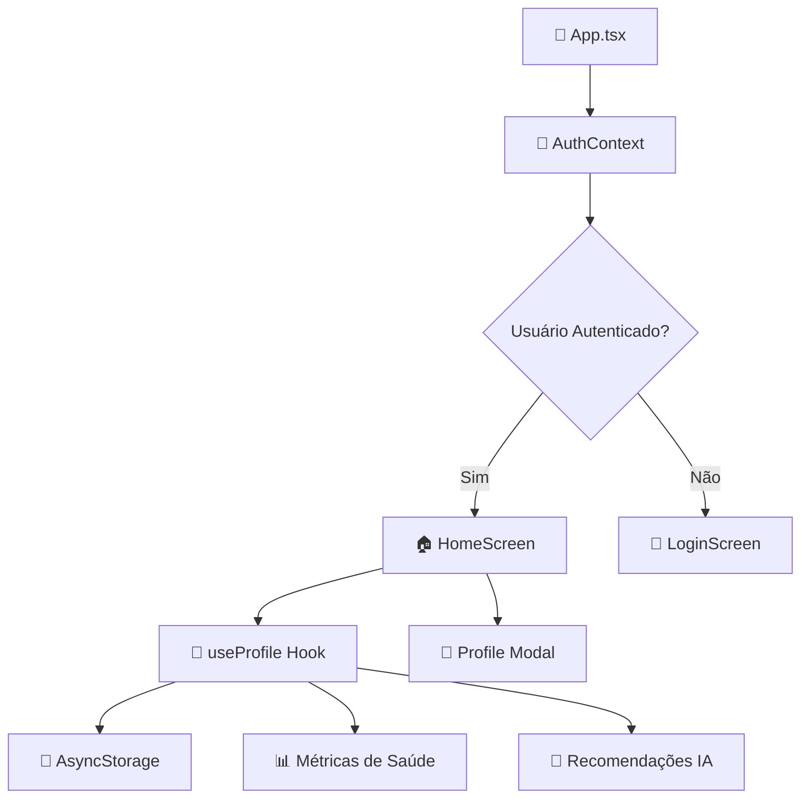

# 🏥 NeoCare - Plataforma Inteligente de Bem-Estar

## Integrantes

Kaue Vinicius Samartino da Silva - RM559317

Davi Praxedes Santos Silva - RM560719

João dos Santos Cardoso de Jesus - RM560400

## 🎯 Sobre o Projeto

### 💡 Problema/Contexto

O estresse é um dos principais problemas de saúde do mundo moderno. Muitas pessoas convivem com altos níveis de estresse diariamente, mas só percebem os sinais quando o corpo e a mente já estão em colapso, resultando em condições graves como ansiedade, burnout ou até AVC.

Atualmente, **não existe uma ferramenta acessível** que monitore continuamente o estado físico e emocional de forma integrada, preventiva e inteligente. As soluções existentes limitam-se a medir dados isolados (como batimentos cardíacos), sem gerar análises significativas ou alertas antecipados.

### 🎯 Solução

**NeoCare** é uma plataforma inteligente de bem-estar que:

- 🔄 **Monitora continuamente** indicadores físicos e emocionais do usuário
- 🔗 **Integra dados** de múltiplas fontes (wearables, sensores e autoavaliações)
- 🧠 **Utiliza IA** para detectar padrões de estresse e prever riscos de colapso
- ⚠️ **Envia alertas preventivos** e recomendações personalizadas de autocuidado
- 🎯 **Objetivo**: Permitir que o usuário aja **antes** que o estresse atinja níveis críticos

---

## 📊 Funcionalidades

### 🏠 Dashboard Principal
- ✅ Visão geral das métricas de saúde em tempo real
- ✅ Status de conexão com sensores/wearables
- ✅ Gráficos de tendências (batimentos cardíacos, estresse, sono)
- ✅ Resumo diário personalizado

### 🔐 Sistema de Autenticação
- ✅ Login/Cadastro com validação completa
- ✅ Persistência de sessão com AsyncStorage
- ✅ Recuperação de senha
- ✅ Dados de perfil sincronizados

### 📈 Monitoramento de Saúde
- ✅ **Batimentos Cardíacos**: Média, mínimo, máximo com alertas
- ✅ **Nível de Estresse**: Escala 0-10 com tendências
- ✅ **Qualidade do Sono**: Análise de padrões noturnos
- ✅ **Atividade Física**: Contagem de passos e exercícios
- ✅ **Hidratação**: Controle de consumo de água

### 🤖 IA e Recomendações
- ✅ Recomendações personalizadas baseadas em perfil
- ✅ Filtragem por horário e contexto
- ✅ Exercícios de respiração, meditação e atividade física
- ✅ Sistema de prioridades (alta, média, baixa)

### 👤 Perfil do Usuário
- ✅ Informações pessoais completas
- ✅ Estatísticas de saúde detalhadas
- ✅ Histórico de atividades
- ✅ Configurações personalizáveis

### 🔧 Sistema de Debug
- ✅ Inspeção completa do AsyncStorage
- ✅ Exportação/importação de dados
- ✅ Simulação de atualizações
- ✅ Comparação de fontes de dados

---

## 🛠️ Tecnologias

### Frontend
- **React Native** 0.81.4 - Framework mobile multiplataforma
- **TypeScript** ~5.9.2 - Tipagem estática
- **Expo** ~54.0.12 - Plataforma de desenvolvimento
- **React Navigation** v7 - Navegação entre telas

### Gerenciamento de Estado
- **React Context API** - Estado global de autenticação
- **Custom Hooks** - Lógica de negócio reutilizável
- **AsyncStorage** - Persistência local de dados

### UI/UX
- **React Native SVG** - Ícones vetoriais personalizados
- **Bootstrap Icons** - Biblioteca de ícones minimalistas
- **Design System** - Cores, tipografia e componentes consistentes

### Arquitetura
- **Hooks Architecture** - Separação de lógica e UI
- **Context Pattern** - Gerenciamento de estado global
- **Component-Based** - Componentes reutilizáveis
- **TypeScript First** - Desenvolvimento type-safe

---

## 🏗️ Arquitetura

```
src/
├── 📱 App.tsx                    # Componente principal e navegação
├── 🔐 contexts/
│   └── AuthContext.tsx          # Contexto de autenticação global
├── 📺 screens/
│   ├── HomeScreen/              # Dashboard principal
│   ├── LoginScreen/             # Tela de login
│   └── CadastroScreen/          # Tela de cadastro
├── 🧩 _components/
│   ├── Profile/                 # Componentes de perfil
│   └── icons/                   # Ícones SVG personalizados
├── 🎣 hooks/
│   ├── useProfile.ts            # 🔥 Hook principal consolidado
│   ├── useHealthMetrics.ts      # ⚠️ Deprecated - usar useProfile
│   ├── useDailyData.ts          # ⚠️ Deprecated - usar useProfile
│   ├── useRecommendations.ts    # Recomendações IA
│   ├── useProfileModal.ts       # Estado do modal de perfil
│   ├── useAsyncStorageDebug.ts  # Debug do AsyncStorage
│   └── useProfileDebug.ts       # Debug específico do perfil
└── 🔧 utils/
    └── AsyncStorageUtils.ts     # Utilitários de persistência
```

### 🔄 Fluxo de Dados



---

## 🚀 Instalação

### Pré-requisitos
- **Node.js** 18+ 
- **npm** ou **yarn**
- **Expo CLI** `npm install -g @expo/cli`
- **Expo Go** (para testes em dispositivo físico)

### Instalação Local

```bash
# Clone o repositório
git clone https://github.com/Kauesamartino/NeocareApp.git
cd NeocareApp

# Instale as dependências
npm install

# Inicie o servidor de desenvolvimento
npm start
# ou
npx expo start
```

### 📱 Executando no Dispositivo

1. **Instale o Expo Go** no seu dispositivo:
   - [Android Play Store](https://play.google.com/store/apps/details?id=host.exp.exponent)
   - [iOS App Store](https://apps.apple.com/app/expo-go/id982107779)

2. **Escaneie o QR Code** que aparece no terminal ou navegador

3. **Ou execute em emulador**:
   ```bash
   # Android
   npm run android
   
   # iOS (somente macOS)
   npm run ios
   ```

---

## 📈 Dados de Demonstração

### 👤 Usuário de Teste
```javascript
{
  "nome": "Maria Silva",
  "email": "maria@exemplo.com",
  "telefone": "(11) 99999-9999", 
  "dataNascimento": "15/03/1990",
  "idade": 34
}
```

### 📊 Métricas Simuladas
- **Batimentos**: 72 bpm (normal)
- **Estresse**: 3.2/10 (atenção)
- **Sono**: 8.5/10 (excelente)
- **Passos**: 8,234 (meta: 8,000)

### 🤖 Recomendações IA
- Respiração profunda (alta prioridade)
- Pausa ativa de 10min (média)
- Meditação guiada (média)

---

## 🔧 Scripts Disponíveis

```bash
# Desenvolvimento
npm start              # Inicia Expo Dev Server
npm run android        # Executa no Android
npm run ios           # Executa no iOS
npm run web           # Executa no navegador

# Build & Deploy
expo build:android    # Build APK/AAB
expo build:ios        # Build IPA
expo publish          # Publica update OTA

# Utilidades
npx tsc --noEmit      # Verificação TypeScript
```

---

## 🏆 Funcionalidades Avançadas

### 🎣 Sistema de Hooks Consolidado

O projeto utiliza uma arquitetura moderna baseada em **Custom Hooks**:

#### `useProfile()` - Hook Principal ⭐
```typescript
const {
  // Dados do perfil
  profileData,
  healthStats,
  
  // Métricas de saúde (ex-useHealthMetrics)
  metrics,
  getStatusColor,
  getStatusText,
  
  // Dados diários (ex-useDailyData)
  dailySummary,
  sensorStatus,
  addExercise,
  addWater,
  
  // Estados
  isLoading,
  error,
} = useProfile();
```

#### Hooks Especializados
- `useRecommendations()` - IA para recomendações personalizadas
- `useProfileModal()` - Gerenciamento do modal de perfil
- `useAsyncStorageDebug()` - Debug completo do storage
- `useProfileDebug()` - Debug específico do perfil

### 🔄 Sincronização de Dados

- **AsyncStorage** para persistência local
- **Sincronização automática** a cada 30s
- **Validação de token** para segurança
- **Fallbacks** para dados offline

### 🎨 Design System

```typescript
// Cores principais
primary: '#2196F3'    // Azul principal
success: '#4CAF50'    // Verde sucesso
warning: '#FF9800'    // Laranja atenção
danger: '#F44336'     // Vermelho crítico

// Status de saúde
normal: '#4CAF50'     // Verde
warning: '#FF9800'    // Laranja
critical: '#F44336'   // Vermelho
```

---

## 🔮 Roadmap Futuro

### 🚀 Próximas Funcionalidades
- [ ] **Integração com Wearables** (Apple Watch, Fitbit)
- [ ] **Machine Learning** avançado para predição
- [ ] **Notificações Push** inteligentes
- [ ] **Relatórios PDF** exportáveis
- [ ] **Compartilhamento** com médicos
- [ ] **Gamificação** e conquistas

### 🔧 Melhorias Técnicas
- [ ] **Testes Unitários** (Jest + Testing Library)
- [ ] **CI/CD Pipeline** (GitHub Actions)
- [ ] **Sentry** para monitoramento de erros
- [ ] **Backend API** com Node.js
- [ ] **Banco de Dados** (PostgreSQL)
- [ ] **Analytics** (Firebase/Amplitude)

### 🌍 Expansão
- [ ] **Modo Offline** completo
- [ ] **Multi-idiomas** (EN, ES)
- [ ] **Acessibilidade** aprimorada
- [ ] **Versão Web** (React)
- [ ] **API Pública** para desenvolvedores

---

## 🧪 Testes e Debug

### 🔍 Debug Tools Integrados

O app inclui ferramentas de debug avançadas:

```typescript
// Debug do AsyncStorage
const { storedData, clearAllData, exportData } = useAsyncStorageDebug();

// Debug do Profile
const { debugData, simulateDataUpdate, compareData } = useProfileDebug();
```

### 📊 Monitoramento

- **Console Logs** estruturados com emojis
- **Comparação de dados** entre fontes
- **Simulação** de atualizações
- **Exportação** de dados para análise

---

## 🤝 Contribuição

### 🔨 Como Contribuir

1. **Fork** o projeto
2. Crie uma **branch** para sua feature (`git checkout -b feature/AmazingFeature`)
3. **Commit** suas mudanças (`git commit -m 'Add some AmazingFeature'`)
4. **Push** para a branch (`git push origin feature/AmazingFeature`)
5. Abra um **Pull Request**

### 📋 Guidelines

- Use **TypeScript** para novos códigos
- Siga os **padrões de commit** convencionais
- Adicione **testes** para novas funcionalidades
- Mantenha a **documentação** atualizada
- Use **ESLint** para consistência de código

### 🐛 Reportar Bugs

Use as [GitHub Issues](https://github.com/Kauesamartino/NeocareApp/issues) para:
- 🐛 Reportar bugs
- 💡 Sugerir features
- 📖 Melhorar documentação
- ❓ Fazer perguntas

---

## 📄 Licença

Este projeto está sob a licença **MIT**. Veja o arquivo [LICENSE](LICENSE) para mais detalhes.

---

## 👨‍💻 Autor

**Kaue Samartino**
- GitHub: [@Kauesamartino](https://github.com/Kauesamartino)
- LinkedIn: [Kaue Samartino](https://linkedin.com/in/kauesamartino)
- Email: kaue@exemplo.com

---

## 🙏 Agradecimentos

- **React Native Community** pela excelente documentação
- **Expo Team** pela plataforma incrível
- **Bootstrap Icons** pelos ícones minimalistas
- **Toda a comunidade** que contribui com o projeto

---

<div align="center">

**⭐ Se este projeto te ajudou, considere dar uma estrela!**

[](https://github.com/Kauesamartino/NeocareApp/stargazers)
[](https://github.com/Kauesamartino/NeocareApp/network/members)

*Feito com ❤️ para promover o bem-estar e a saúde mental*

</div>
