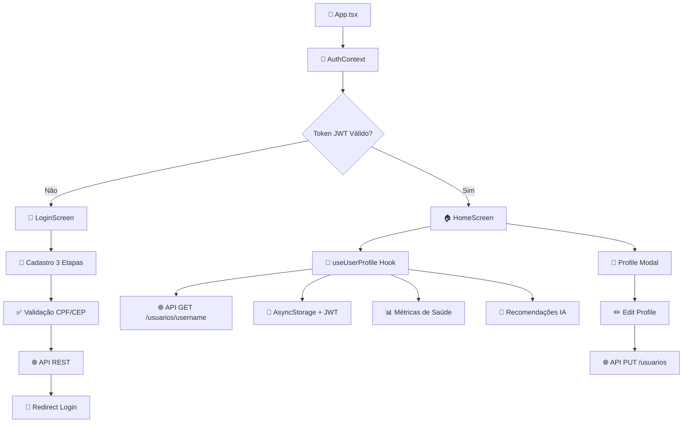

# 🏥 NeoCare - Plataforma Inteligente de Bem-Estar

## Integrantes

Kaue Vinicius Samartino da Silva - RM559317

Davi Praxedes Santos Silva - RM560719

João dos Santos Cardoso de Jesus - RM560400

## Link video apresentação
https://youtube.com/shorts/wNFBLLNyFY4?feature=share

## 🎯 Sobre o Projeto

### 💡 Problema/Contexto

O estresse é um dos principais problemas de saúde do mundo moderno. Muitas pessoas convivem com altos níveis de estresse diariamente, mas só percebem os sinais quando o corpo e a mente já estão em colapso, resultando em condições graves como ansiedade, burnout ou até AVC.

Atualmente, **não existe uma ferramenta acessível** que monitore continuamente o estado físico e emocional de forma integrada, preventiva e inteligente. As soluções existentes limitam-se a medir dados isolados (como batimentos cardíacos), sem gerar análises significativas ou alertas antecipados.

### 🎯 Solução

**NeoCare** é uma plataforma inteligente de bem-estar que:

- 🔄 **Monitora continuamente** indicadores físicos e emocionais do usuário
- 🔗 **Integra dados** de múltiplas fontes (wearables, sensores e autoavaliações)
- 🧠 **Utiliza IA** para detectar padrões de estresse e prever riscos de colapso
- ⚠️ **Envia alertas preventivos** e recomendações personalizadas de autocuidado
- 🎯 **Objetivo**: Permitir que o usuário aja **antes** que o estresse atinja níveis críticos

---

## 📊 Funcionalidades

### 🏠 Dashboard Principal
- ✅ Visão geral das métricas de saúde em tempo real
- ✅ Status de conexão com sensores/wearables
- ✅ Gráficos de tendências (batimentos cardíacos, estresse, sono)
- ✅ Resumo diário personalizado

### 🔐 Sistema de Autenticação
- ✅ **Login completo** com autenticação via API REST
- ✅ **Cadastro em 3 etapas**: Dados pessoais → Credenciais → Endereço
- ✅ **Validação robusta** de CPF, CEP e dados obrigatórios
- ✅ **Persistência segura** de tokens JWT no AsyncStorage
- ✅ **Migração automática** de dados antigos
- ✅ **Tratamento de erros** personalizado com tipos específicos
- ✅ **Redirecionamento inteligente** após cadastro para login

### 📈 Monitoramento de Saúde
- ✅ **Batimentos Cardíacos**: Média, mínimo, máximo com alertas
- ✅ **Nível de Estresse**: Escala 0-10 com tendências
- ✅ **Qualidade do Sono**: Análise de padrões noturnos
- ✅ **Atividade Física**: Contagem de passos e exercícios
- ✅ **Hidratação**: Controle de consumo de água

### 🤖 IA e Recomendações
- ✅ Recomendações personalizadas baseadas em perfil
- ✅ Filtragem por horário e contexto
- ✅ Exercícios de respiração, meditação e atividade física
- ✅ Sistema de prioridades (alta, média, baixa)

### 👤 Perfil do Usuário
- ✅ **Informações pessoais** completas com validação
- ✅ **Edição de perfil** com modal interativo
- ✅ **Integração com API** para busca e atualização de dados
- ✅ **Validação de campos** (CPF, CEP, telefone)
- ✅ **Formatação automática** de dados (CEP: XXXXX-XXX)
- ✅ **Sistema de fallback** para dados offline
- ✅ **Debug avançado** do perfil e autenticação

### 🔧 Sistema de Debug & Validação
- ✅ **Inspeção completa** do AsyncStorage
- ✅ **Validação de CPF** com algoritmo de dígitos verificadores
- ✅ **Validação de CEP** com formatação automática (XXXXX-XXX)
- ✅ **Busca automática** de endereço via API ViaCEP
- ✅ **Tratamento de erros** com tipos específicos (CPF_INVALID, VALIDATION_ERROR)
- ✅ **Logs estruturados** com emojis para debugging
- ✅ **Migração automática** de dados antigos para nova estrutura
- ✅ **Comparação de fontes** de dados (API vs AsyncStorage)

---

## 🛠️ Tecnologias

### Frontend
- **React Native** 0.81.4 - Framework mobile multiplataforma
- **TypeScript** ~5.9.2 - Tipagem estática
- **Expo** ~54.0.12 - Plataforma de desenvolvimento
- **React Navigation** v7 - Navegação entre telas
- **Axios** - Cliente HTTP para integração com API

### Gerenciamento de Estado
- **React Context API** - Estado global de autenticação
- **Custom Hooks** - Lógica de negócio reutilizável
- **AsyncStorage** - Persistência local de tokens e dados do usuário
- **JWT Authentication** - Tokens seguros para autenticação
- **Error Handling** - Sistema robusto de tratamento de erros

### UI/UX
- **React Native SVG** - Ícones vetoriais personalizados
- **Bootstrap Icons** - Biblioteca de ícones minimalistas
- **Design System** - Cores, tipografia e componentes consistentes

### Backend & API
- **API REST** - Endpoints para autenticação e gerenciamento de usuários
- **Validação de dados** - CPF, CEP, email com algoritmos específicos
- **Sistema de erros** - Códigos e mensagens padronizados
- **Formatação automática** - CEP (XXXXX-XXX), telefone, CPF

### Arquitetura
- **Hooks Architecture** - Separação de lógica e UI
- **Context Pattern** - Gerenciamento de estado global
- **Component-Based** - Componentes reutilizáveis
- **TypeScript First** - Desenvolvimento type-safe
- **Error-First Design** - Tratamento robusto de erros e validações

---

## 🏗️ Arquitetura

```
src/
├── 📱 App.tsx                    
├── 🔐 contexts/
│   └── AuthContext.tsx          # Context completo com JWT e migração
├── 📺 screens/
│   ├── HomeScreen/              
│   ├── LoginScreen/             # Login com API REST
│   ├── CadastroScreen/          # Cadastro em etapas
│   ├── CadastroDadosPessoaisScreen/
│   ├── CadastroCredenciaisScreen/
│   └── CadastroEnderecoScreen/  # Validação de CEP via ViaCEP
├── 🧩 _components/
│   ├── Profile/                 # Modal de perfil e edição
│   └── icons/                   # Ícones customizados
├── 🎣 hooks/
│   ├── useUserProfile.ts        # Integração com API de usuários
│   ├── useHealthMetrics.ts      
│   ├── useDailyData.ts         
│   ├── useRecommendations.ts    
│   └── useProfileModal.ts       
├── 🌐 services/
│   └── api.ts                   # Cliente HTTP com endpoints
├── 🔧 utils/
│   ├── AsyncStorageUtils.ts     
│   ├── cpfUtils.ts             # Validação e formatação de CPF
│   ├── formatUtils.ts          # Formatação de CEP e telefone
│   └── errorUtils.ts           # Sistema de tratamento de erros
└── � types/
    └── cadastro.ts             # Tipos TypeScript para cadastro
```

### 🔄 Fluxo de Dados



---

## 🚀 Instalação

### Pré-requisitos
- **Node.js** 18+ 
- **npm** ou **yarn**
- **Expo CLI** `npm install -g @expo/cli`
- **Expo Go** (para testes em dispositivo físico)

### Instalação Local

```bash
# Clone o repositório
git clone https://github.com/Kauesamartino/NeocareApp.git
cd NeocareApp

# Instale as dependências
npm install

# Inicie o servidor de desenvolvimento
npm start
# ou
npx expo start
```

### 📱 Executando no Dispositivo

1. **Instale o Expo Go** no seu dispositivo:
   - [Android Play Store](https://play.google.com/store/apps/details?id=host.exp.exponent)
   - [iOS App Store](https://apps.apple.com/app/expo-go/id982107779)

2. **Escaneie o QR Code** que aparece no terminal ou navegador

3. **Ou execute em emulador**:
   ```bash
   # Android
   npm run android
   
   # iOS (somente macOS)
   npm run ios
   ```

---

## 📈 Dados de Demonstração

### 📊 Métricas Simuladas
- **Batimentos**: 72 bpm (normal)
- **Estresse**: 3.2/10 (atenção)
- **Sono**: 8.5/10 (excelente)
- **Passos**: 8,234 (meta: 8,000)

### 🤖 Recomendações IA
- Respiração profunda (alta prioridade)
- Pausa ativa de 10min (média)
- Meditação guiada (média)

---

## 🔧 Scripts Disponíveis

```bash
# Desenvolvimento
npm start              # Inicia Expo Dev Server
npm run android        # Executa no Android
npm run ios           # Executa no iOS
npm run web           # Executa no navegador

# Build & Deploy
expo build:android    # Build APK/AAB
expo build:ios        # Build IPA
expo publish          # Publica update OTA

# Utilidades
npx tsc --noEmit      # Verificação TypeScript
```

---

## 🏆 Funcionalidades Avançadas

### 🎣 Sistema de Hooks & API Integration

O projeto utiliza uma arquitetura moderna baseada em **Custom Hooks** integrados com **API REST**:

#### `useUserProfile()` - Hook Principal ⭐
```typescript
const {
  // Dados do usuário da API
  user,
  isLoading,
  error,
  
  // Operações CRUD
  refreshProfile,      // GET /usuarios/username/{username}
  updateProfile,       // PUT /usuarios
  
  // Utilidades
  getUserDataForUpdate,
  isUpdating,
} = useUserProfile();
```

#### Sistema de Validação
```typescript
// Validação de CPF
validateCPF("47169146827") // true/false
formatCPF("47169146827")   // "471.691.468-27"

// Formatação de CEP
formatCEP("02314070")      // "02314-070"
validateCEP("02314-070")   // true/false

// Tratamento de erros
try {
  await apiUpdateUser(userData, token);
} catch (error) {
  if (error.type === ErrorType.CPF_INVALID) {
    // Tratar erro específico de CPF
  }
}
```

#### Hooks Especializados
- `useRecommendations()` - IA para recomendações personalizadas
- `useProfileModal()` - Gerenciamento do modal de perfil
- `useAsyncStorageDebug()` - Debug completo do storage
- `useProfileDebug()` - Debug específico do perfil

### 🔄 Sincronização & Autenticação

- **JWT Tokens** para autenticação segura
- **API REST** com endpoints padronizados:
  - `POST /api/auth/login` - Autenticação
  - `POST /usuarios` - Cadastro de usuário
  - `GET /usuarios/username/{username}` - Buscar perfil
  - `PUT /usuarios` - Atualizar perfil
- **AsyncStorage** para persistência de tokens e dados
- **Validação automática** de tokens e refresh
- **Migração de dados** entre versões da estrutura
- **Fallbacks inteligentes** para cenários offline

### 🎨 Design System

```typescript
// Cores principais
primary: '#2196F3'    // Azul principal
success: '#4CAF50'    // Verde sucesso
warning: '#FF9800'    // Laranja atenção
danger: '#F44336'     // Vermelho crítico

// Status de saúde
normal: '#4CAF50'     // Verde
warning: '#FF9800'    // Laranja
critical: '#F44336'   // Vermelho
```

---

## 🔮 Roadmap Futuro

### 🚀 Próximas Funcionalidades
- [ ] **Integração com Wearables** (Apple Watch, Fitbit)
- [ ] **Machine Learning** avançado para predição de estresse
- [ ] **Notificações Push** baseadas em padrões de saúde
- [ ] **Relatórios médicos** em PDF exportáveis
- [ ] **Compartilhamento seguro** com profissionais de saúde
- [ ] **Gamificação** com metas e conquistas de bem-estar
- [ ] **Integração com planos de saúde**
- [ ] **Telemedicina** integrada

### 🔧 Melhorias Técnicas
- [ ] **Testes Unitários** (Jest + Testing Library)
- [ ] **Testes de Integração** para APIs
- [ ] **CI/CD Pipeline** (GitHub Actions)
- [ ] **Sentry** para monitoramento de erros em produção
- [ ] **Banco de Dados** (PostgreSQL) para backend
- [ ] **Cache Redis** para performance
- [ ] **Rate Limiting** e segurança de API
- [ ] **Documentação Swagger** para APIs
- [ ] **Logs estruturados** (Winston/Pino)
- [ ] **Analytics** (Firebase/Amplitude)

### 🌍 Expansão
- [ ] **Modo Offline** completo
- [ ] **Multi-idiomas** (EN, ES)
- [ ] **Acessibilidade** aprimorada
- [ ] **Versão Web** (React)
- [ ] **API Pública** para desenvolvedores

---

## 🌐 API Endpoints

### 🔐 Autenticação
```http
POST /api/auth/login
Content-Type: application/json

{
  "username": "kauesamartino",
  "password": "senha123"
}

Response: {
  "token": "eyJhbGciOiJIUzI1NiIs...",
  "username": "kauesamartino", 
  "roles": ["USER"]
}
```

# Buscar perfil do usuário
GET /usuarios/username/{username}
Authorization: Bearer {token}

# Atualizar dados do usuário  
PUT /usuarios
Authorization: Bearer {token}
Content-Type: application/json
```

### 🛡️ Validações Implementadas

- **CPF**: Algoritmo de dígitos verificadores
- **CEP**: Formato XXXXX-XXX obrigatório
- **Email**: Validação de formato padrão
- **Telefone**: Formatação (XX) XXXXX-XXXX
- **Campos obrigatórios**: Nome, email, username, password

---

## 🧪 Testes e Debug

### 🔍 Debug Tools Integrados

O app inclui ferramentas de debug avançadas para desenvolvimento:

```typescript
// Debug completo de autenticação
await debugAuthStorage();

// Correção automática de username
await fixUsername();

// Logout forçado para limpeza
await forceLogout();

// Validações integradas
const isValidCPF = validateCPF("47169146827");
const formattedCEP = formatCEP("02314070");

// Tratamento de erros específicos
catch (error) {
  if (error instanceof AppError) {
    switch(error.type) {
      case ErrorType.CPF_INVALID:
      case ErrorType.VALIDATION_ERROR:
      case ErrorType.NETWORK_ERROR:
    }
  }
}
```

### 📊 Monitoramento & Logs

- **Console Logs estruturados** com emojis para categorização
- **Tracking completo** do fluxo de autenticação
- **Validação em tempo real** de dados críticos (CPF, CEP)
- **Detecção automática** de problemas de migração
- **Logs de API** com request/response detalhados
- **Debug de tokens** JWT com verificação de validade
- **Comparação de dados** entre diferentes fontes
- **Exportação de dados** para análise e troubleshooting

---

## 🤝 Contribuição

### 🔨 Como Contribuir

1. **Fork** o projeto
2. Crie uma **branch** para sua feature (`git checkout -b feature/AmazingFeature`)
3. **Commit** suas mudanças (`git commit -m 'Add some AmazingFeature'`)
4. **Push** para a branch (`git push origin feature/AmazingFeature`)
5. Abra um **Pull Request**

### 📋 Guidelines

- Use **TypeScript** para novos códigos
- Siga os **padrões de commit** convencionais
- Adicione **testes** para novas funcionalidades
- Mantenha a **documentação** atualizada
- Use **ESLint** para consistência de código

### 🐛 Reportar Bugs

Use as [GitHub Issues](https://github.com/Kauesamartino/NeocareApp/issues) para:
- 🐛 Reportar bugs
- 💡 Sugerir features
- 📖 Melhorar documentação
- ❓ Fazer perguntas

---

## 📄 Licença

Este projeto está sob a licença **MIT**. Veja o arquivo [LICENSE](LICENSE) para mais detalhes.

---

## 👨‍💻 Autor

**Kaue Samartino**
- GitHub: [@Kauesamartino](https://github.com/Kauesamartino)
- LinkedIn: [Kaue Samartino](https://linkedin.com/in/kauesamartino)
- Email: kaue@exemplo.com

---

## 🙏 Agradecimentos

- **React Native Community** pela excelente documentação
- **Expo Team** pela plataforma incrível
- **Bootstrap Icons** pelos ícones minimalistas
- **Toda a comunidade** que contribui com o projeto

---

<div align="center">

**⭐ Se este projeto te ajudou, considere dar uma estrela!**

[](https://github.com/Kauesamartino/NeocareApp/stargazers)
[](https://github.com/Kauesamartino/NeocareApp/network/members)

*Feito com ❤️ para promover o bem-estar e a saúde mental*

</div>
